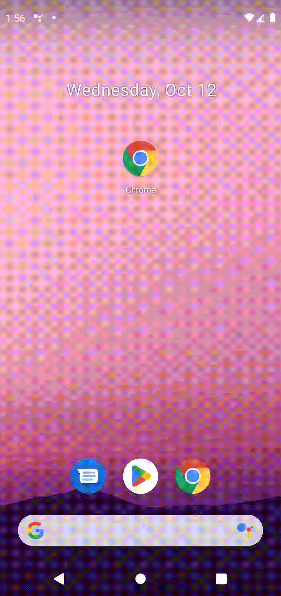

## **What is Fragment testing on Android**


Firstly, we need to know what Fragments in Android are.


Fragments are reusable containers within our app allowing us to present the same user interface layout in a variety of activities and layout configurations. Given the versatility of fragments, it's important to validate that they provide a consistent and resource-efficient experience.

Note the following:
* Your fragment shouldn't be dependent on a specific parent activity or another fragment.
* You shouldn't create a fragment's view hierarchy unless the fragment is visible to the user.

To perform Fragments testing we have such helper as AndroidX "fragment-testing" library, which provides the "FragmentScenario" class to create Fragments and change their `Lifecycle.State`. We are able to launch the screen we want to test and skip the rest.


## **Let's Start**

## 0. Before
I'm going to use our test Application to showcase. It's called Jukebox (and was created by our awesome android developer Kunal Jadhav). It's a simple application but ideal for a demo. Let's have a look at it.


As you can see we have Login, Playing Now, Most Popular and More Menu Screens.

For the demo I want to test Title on Most Popular Screen and check if it contains text according to the requirements or not.

**Before**<br>
In our usual approach(E2E) we would have written a test which would do the following:
- Open the app
- Enter Username and Password
- Click Login button
- Select Most Popular tab
- Check Title

**Now**<br>
Fragments testing approach:
- Open the app at Most Popular Screen in Fragment
- Check Title

What do we need to start using Fragments for testing? The First thing is Dependencies.

## 1. Dependencies

```kotlin
dependencies {
  
  //Fragment testing library
  debugImplementation ('androidx.fragment:fragment-testing:1.5.3')
  
  //Espresso and test utilities for local and instrumentation tests
  testImplementation ('junit:junit:4.13.2')
  debugImplementation ('androidx.test:core:1.4.0')
  androidTestImplementation ('androidx.test:runner:1.4.0')
  androidTestImplementation ('androidx.test.ext:junit:1.1.3')
  androidTestImplementation ('androidx.test.ext:junit-ktx:1.1.2')
  androidTestImplementation ('androidx.test:rules:1.4.0')
  androidTestImplementation ('androidx.test.espresso:espresso-core:3.1.0')
  androidTestImplementation ('androidx.test.espresso:espresso-contrib:3.1.0')
  androidTestImplementation ('androidx.test.espresso:espresso-intents:3.1.0')
  androidTestImplementation ('androidx.test.ext:junit-ktx:1.1.2')
  androidTestImplementation ('androidx.test.uiautomator:uiautomator:2.2.0')
  androidTestUtil ('androidx.test:orchestrator:1.4.1')
  
}
```
NOTE: List of Dependencies(please, be aware of outdated versions)

## 2. Coding

As mentioned earlier, the “fragment-testing” library provides the FragmentScenario class to create fragments. The launchScreen method allows us to launch a fragment which contains a UI. Afterwards, your fragment will be attached to the Activity's root view.

```kotlin
/**
 * Launch a screen fragment with the given [fragmentArgs] but its optional.
 */
inline fun <reified S : Fragment> launchScreen(   
  fragmentArgs: Bundle? = null,
  @StyleRes themeResId: Int = R.style.Theme_MyApplication) = launchFragmentInContainer<S>(fragmentArgs)
```

We have launchScreen method, and we can go further. The next stop is our @Before the test part.

```kotlin
@Before 
override fun setUp() {   
  mockedModule = module(override = true) {}
  super.setUp()
  launchScreen<com.bb.qa_assignment.journey.dashboard.mostPopular.MostPopularScreen>()
  mostPopularScreen = MostPopularScreen()
}
```
The first part can be our mocked modules. In some of our  projects we use different mocks but its not required for this test project. We can see launchScreen method where we provide the Screen path we want to launch.

```kotlin
@Test
fun testScreenContent() {
    mostPopularScreen.apply {
      mostPopularTitle.shouldHaveText(R.string.label_most_popular)
    }
}
```
In the test we check whether the title is there displaying the text specified in the requirements.

## 3. Results



Looks pretty nice (if you don't blink) :)

## 4. Metrics

Testing android Fragments in isolation gives us time to d̶r̶i̶n̶k̶ ̶c̶o̶f̶f̶e̶e̶. Seriously, the most important benefits of using such an approach is decreasing execution time and increasing coverage. Let’s compare some results.

I've made the same test but as E2E. You can see the results below.


The same checks are done using the different approaches. Fragment test is more than 5 times faster, and we avoid possible fails during test execution. Sounds amazing. If we think about the scalability of these tests then the results are even more impressive.
Just imagine that in your project there are 100 E2E tests (execution time of ~20 minutes based on my previous project) and then you replace half of them with Fragment tests. The same checks are performed but your execution time decreases to ~7-8 minutes. You get more stable and less flaky tests.

## 5. Conclusion

I would be really happy if that was the end. Sadly, there are some caveats you must be aware of.

- Testing with Fragments has a close connection with the source code of an app.
  You will need to maintain your Fragment tests when some changes in source code occur. It's easier than maintaining E2E but in some cases might get tricky.
- Limitations of testing Real API calls, Some specific logic, Navigation.
  You will not able to use Real API calls, all the data should be mocked.
  It's not possible to check cases if you need to change your Activity.
  It's possible to make a check for navigation but with limitations. It's still better to use E2E tests for that.


## **Final Thoughts**

Introducing Fragments tests won't replace your E2E tests. It should be a mix of E2E and testing with Fragments. That mix gives you the power that your previous automation tool never dreamed of.

The most useful source: https://developer.android.com/guide/fragments/test

Special thanks to: Maria Vlasova
