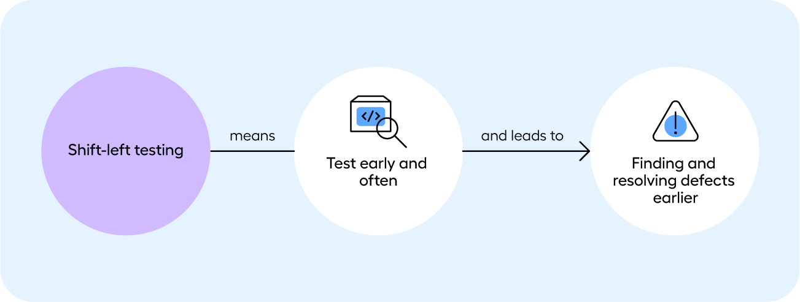
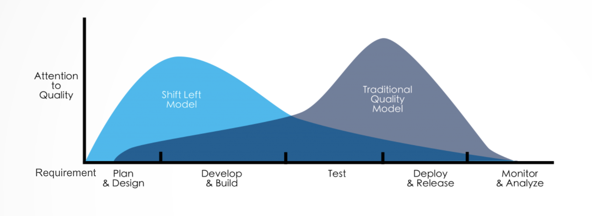

“**Shift left**” testing movement is about pushing testing towards the early stages of Software Development Life Cycle.

By testing **early and often**, a project can reduce the number of bugs and increase the quality of the code.

## **Traditional Quality Model vs Shift Left Model**

Up until the late 1990s, stakeholders favored quality only at the latest phases of the software development lifecycle - more specifically, the testing and deployment phases.

When testing is paused until the end of development, any bugs that do show up will usually be more difficult to fix. In severe cases, their resolution needs the software to be reworked in its entirety. Consequences of such an approach would be:

- Poor quality product delivered to customer, prone to critical bugs.
- Increase in cost, since the software needs to be sent back and reworked from scratch.
- Increased time to market since such reworks will take longer to complete.

Worst case, developers have to redesign the application.

So, here we are with problem statement from Traditional Quality Model

**🚨The problem** - Poor quality product resulting in delayed time to market.

**🎯The goal** - Better code, high quality product and faster time to market.

**💡The solution** - Adopt **SHIFT LEFT APPROACH** to Testing
 
 

## Shift Left Approach for FRs within development cycle

Presenting to you, the **Quality Assistance Approach**(as we call in BB) which emphasises on early testing and leaving minimal room for critical/ blocker issues by the end of the development cycle.

Navigating phase by phase:
- As the development cycle starts, QAs to write high-level test cases against each user story during the planning day or the 1st day of the development cycle
- QAs to then organise 'Kick-off' session (preferably the next day) where tests are reviewed with developers and other stakeholders(such as BAs or SAs) to ensure everyone is on the same page for feature Requirements and Acceptance Criteria
- After the Kick-off session, as the development of the feature takes place, QAs focus on developing test automation scripts
- After the features are developed, Dev sets up a 'Review' session with QA before pushing code to the test environment(even before creating a PR). Note that this is not an actual testing phase, but all bugs found during review can be fixed immediately by the Dev
- If QA and Dev are both happy with the developed feature, then Dev releases the code for further testing and QA starts test execution

Key benefits of above approach within the development cycle:

- Development team is aligned on the requirements
- Leaves minimal room for critical/blocker bugs
- QA can inform the developers about issues in the review session which can be fixed right away
- QA knows where to focus when the functionality is released to test
- QAs have increased time for exploratory testing
- QAs have increased time for UI automation within the development cycle
 
 

## Shift Left Approach for NFRs

**Non-Functional Requirements(NFRs)** of a product define the systems operational attributes like **performance, accessibility, reliability, usability, scalability, load, stress, recoverability, security, localisation, etc**.
Besides being operational and compliance must-haves, NFRs are also essential contributors to the value proposition of the product. These factors can be a key differentiator of the product in the market.

In traditional quality model, often the release roadmaps are designed in such a way that the NFRs are slotted for last few weeks of the delivery. The teams end up testing NFRs in a hurry to meet the release deadlines, leading to low confident, risky releases with a compromise in quality.
Hence, NFR testing must also shift-left and prep must start right from Requirement phase of SDLC.

_Requirement phase:_ Identify the NFRs and prioritise them

_Design phase:_
- Define and agree on the DoD of the product
- Capture the NFRs as part of Acceptance Criteria on User Story level
- Story estimates includes the effort of NFRs
- System architecture is designed taking NFRs into account.

_Development phase:_
- NFR test scenarios are written considering Acceptance Criteria
- Kickoff session should include NFR test scenarios

_Test phase:_ NFR execution is performed along with Functional test execution, before moving the User Story to “QA Done”

_Production & Maintenance phase:_ Release is deployed in production. All FRs and NFRs are complete. Thus, reducing the risk of NFRs impacting delivery timelines.
 
 

## Key benefits of Shift Left Approach to Testing

- Reduced costs involved in Development and Testing as bugs detected earlier are cheaper to fix. 
- Reduced risk of NFR bugs impacting the delivery timeline. 
- Increased efficiency in the software development process as effective utilisation of time and resources. 
- Early Bug Detection ensures Better Code and Product Quality. 
- Offers a competitive advantage in the market as higher quality product is delivered. 
- Enhanced Test Coverage, considering both functional and NFRs are covered as part of test suite and the application is evaluated for all its features. 
- QAs have more room for automation and exploratory testing within the development cycle.

